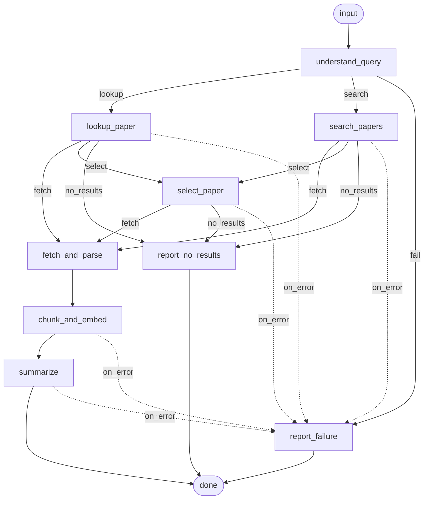

# arXiv Digest & QA Agent

Give it a topic or an arXiv id. It finds the paper, reads the PDF, writes a
structured executive briefing, and then answers follow-up questions grounded in
the paper's own text, citing the sections it used and saying "not in the
paper" when that's the honest answer.

```bash
python -m arxiv_agent brief "recent work on KV-cache compression for LLMs"
python -m arxiv_agent brief 2401.12345 --no-chat
python -m arxiv_agent chat  s1712345678-ab12cd
```

Runs fully local (Ollama + sentence-transformers + Chroma) or on any free-tier
hosted model. **No paid API key is required.**

---

## Contents

1. [Quickstart](#quickstart)
2. [Architecture — the state graph](#architecture--the-state-graph)
3. [State shape](#state-shape)
4. [Example run](#example-run)
5. [How each hard part is handled](#how-each-hard-part-is-handled)
6. [Design decisions & tradeoffs](#design-decisions--tradeoffs)
7. [Known limitations & what I'd do next](#known-limitations--what-id-do-next)
8. [Tests](#tests)
9. [Configuration reference](#configuration-reference)

---

## Quickstart

### 0. See it work in five seconds, with nothing installed but PyMuPDF

```bash
pip install -r requirements-min.txt    # requests + PyMuPDF + pytest, ~40 MB
python scripts/demo_offline.py
```

This runs the entire graph (real parser, real chunker, real vector store, real
retrieval and citation checking) against a synthetic paper with a scripted LLM.
No network, no API key, no model download. Output is in
[`examples/example_run.md`](examples/example_run.md).

### 1. Install

```bash
git clone <this-repo> && cd arxiv-digest-agent
python -m venv .venv && source .venv/bin/activate   # Windows: .venv\Scripts\activate
pip install -r requirements.txt
pip install -e .
```

Prefer a light install? `pip install -r requirements-min.txt` skips Chroma and
`sentence-transformers` (~40 MB instead of ~2.5 GB). The agent falls back to a
built-in exact-cosine store and a lexical embedder, and **tells you it did**.

### 2. Pick an LLM

**Local (default, no key):**

```bash
# https://ollama.com/download
ollama serve
ollama pull qwen2.5:7b-instruct
```

**Or a hosted free tier:**

```bash
cp .env.example .env
# put ONE of these in .env:
#   GROQ_API_KEY=...          (console.groq.com — generous free tier)
#   GOOGLE_API_KEY=...        (aistudio.google.com — Gemini free tier)
#   OPENROUTER_API_KEY=...    (openrouter.ai — has :free models)
```

Then run with `--provider groq` (or `gemini`, `openrouter`).

> **Rate limits when testing.** Free tiers are metered per minute and per day,
> and the exact numbers change, so check your provider's dashboard. A single
> briefing costs roughly **3–6 LLM calls** for a short paper (query plan,
> re-rank, briefing, occasionally a limitations retry) and up to ~15 for a long
> one that triggers map-reduce; each QA turn costs 1–2. If you hit a 429 the
> client backs off and retries, honouring `Retry-After`. Ollama has no limits at
> all and is the safest way to grade this.

### 3. Check the setup

```bash
python -m arxiv_agent doctor
```

Prints which backends resolved and does one live LLM round-trip.

### 4. Use it

```bash
python -m arxiv_agent brief "speculative decoding for long-context inference"
```

The briefing is printed and saved to
`~/.arxiv_agent/sessions/<session>/briefing.{md,json}`, then you drop straight
into QA. Later:

```bash
python -m arxiv_agent sessions                        # list past runs
python -m arxiv_agent chat <session_id>               # resume QA
python -m arxiv_agent ask  <session_id> "..." --json  # one-shot, machine readable
python -m arxiv_agent show <session_id>               # reprint a briefing
python -m arxiv_agent graph                           # mermaid of the graph
```

---

## Architecture — the state graph

Nodes mutate one shared `AgentState`; **routing is separate from node work**, so
the graph is data and can draw itself. The diagram below is emitted by
`python -m arxiv_agent graph`, generated from the live wiring, so it cannot drift
from the code.



A **second, tiny graph** handles QA (`answer_question → END`). It shares the same
state object and the same checkpointer. They are separate because their
lifecycles differ: the briefing graph is a one-shot DAG, while the QA graph is
re-entered many times, often in a different process days later. Splitting them
keeps the briefing DAG acyclic and makes "resume a session" a two-liner.

| Node | Does | Retries | On failure |
|---|---|---|---|
| `understand_query` | regex for an arXiv id; else LLM → structured query plan | 0 | critical |
| `lookup_paper` | resolve a known id via the Atom API | 2 | → `report_failure` |
| `search_papers` | topic search + relaxation ladder | 2 | → `report_failure` |
| `select_paper` | hybrid re-rank; disambiguate on a near-tie | 1 | → `report_failure` |
| `fetch_and_parse` | download PDF, extract, quality-gate | 1 | **non-critical → degrades** |
| `chunk_and_embed` | section-aware chunking, embed, upsert | 1 | → `report_failure` |
| `summarize` | evidence pack (or map-reduce) → structured briefing | 1 | → `report_failure` |
| `report_no_results` / `report_failure` | terminal nodes that explain what happened | — | — |

The runtime itself (`graph/engine.py`, ~230 lines) provides: per-node retry with
exponential backoff, criticality flags, `on_error` routing, a step-limit cycle
guard, timing in the trace, and **a checkpoint after every single node**.

---

## State shape

One `AgentState` dataclass of JSON-serialisable primitives
(`src/arxiv_agent/state.py`), checkpointed atomically (tmp + `os.replace`) to
`~/.arxiv_agent/sessions/<session_id>/state.json` after each node.

```python
session_id, created_at, updated_at

raw_input, intent, arxiv_id, query_plan        # stage 1
query_attempts[], candidates[]                 # stage 2  (every arXiv query, with hit counts)
paper, selection_rationale, runners_up[]       # stage 3
pdf_path, parsed_path, parse_report            # stage 4  (parsed_path is a *reference*)
collection, chunk_count, embedder,             # stage 5
  vector_backend
briefing, briefing_md_path,                    # stage 6
  briefing_json_path
qa_history[], pending_question                 # stage 7

status, halt_reason, errors[], trace[]         # control plane
```

**Big blobs stay out of the state.** Full parsed text goes to a `parsed.json`
sidecar and the chunks go to the vector store; the state holds only paths and a
collection name. That keeps checkpointing cheap (state files are a few KB even
for a 60-page paper) and keeps `state.json` readable when you're debugging a bad
run.

**Persistence between summarisation and QA** is therefore two files plus one
collection:

```
~/.arxiv_agent/
├── sessions/<session_id>/
│   ├── state.json        ← the AgentState, including full qa_history
│   ├── parsed.json       ← sections + references
│   ├── briefing.md
│   └── briefing.json
├── vectorstore/          ← Chroma (or the flat fallback), one collection per paper
└── pdf_cache/            ← downloaded PDFs, reused across runs
```

Collections are named `p_<arxiv_id>_<embedder>`, so re-briefing a paper reuses
existing embeddings, and changing embedding model can never mix two vector
spaces in one collection.

---

## Example run

Verbatim output from `python scripts/demo_offline.py` lives in
[`examples/example_run.md`](examples/example_run.md). Abridged:

```text
--- what the graph did ---
      ↳ LLM plan: wants recent method papers on shrinking the KV cache
  understand_query   ok       0.00s
      ↳ 2 candidates after 2 query variant(s)
  search_papers      ok       0.00s
      ↳ selected 2402.09876: PagedCache: Block-Sparse KV Cache Compression ...
  select_paper       ok       0.00s
      ↳ parser=pymupdf quality=0.98 sections=5 chars=4321 degraded=False
  fetch_and_parse    ok       0.01s
      ↳ embedded 7 chunks (avg 676 chars) into p_2402_09876_hashing_384
  chunk_and_embed    ok       0.01s
  summarize          ok       0.00s

--- queries sent to the arXiv API ---
  L0: (all:"KV cache compression" AND all:"long context inference")
      AND (cat:cs.CL OR cat:cs.LG) AND submittedDate:[202401010000 TO ...]  -> 2 hits
  L1: (all:"KV cache compression" AND all:"long context inference")
      AND (cat:cs.CL OR cat:cs.LG)                                          -> 2 hits

--- selection ---
  top of 2 candidates (score 0.716, gap to runner-up 0.259);
  components={'similarity': 0.67, 'arxiv_rank': 1.0, 'recency': 0.179, 'llm': 0.95};
  LLM: concrete compression method
  runner-up: 0.457  A Survey of Memory-Efficient Inference
```

Briefing (abridged; full Markdown in the example file):

```markdown
# PagedCache: Block-Sparse KV Cache Compression for Long-Context LLMs

**arXiv:** [2402.09876v2](https://arxiv.org/abs/2402.09876)
**Authors:** A. Researcher, B. Coauthor
**Published:** 2024-02-15 (updated 2024-03-01)

## Why this paper matters
Long-context serving is memory bound, and this work shows the KV cache can be
compressed in place rather than evicted ...

## Key results and claims
- 4.1x memory reduction at 128k context with 0.3 PPL degradation _[C4]_
- 1.7x throughput improvement at batch size 32 _[C4]_

## Limitations
- English-only evaluation
- Only two model families below 10B parameters
- No mixture-of-experts results

## Provenance
- Briefing confidence: **high** — method and results sections parsed cleanly
- PDF parser: `pymupdf` · Pages parsed: `3/3` · Chunks indexed: `7`
```

Three QA exchanges. Note the third:

```text
you > How does the block scoring actually work?
PagedCache splits the KV cache into fixed blocks of 64 tokens and scores each
block by the mean attention mass it receives over a sliding window of 512
queries [C1]. The top 12% of blocks stay in fp16 ... [C1]
Sources:
  [C1] 3 Method (p.2-2) · sim 0.102
  grounded=True  abstained=False

you > What datasets and baselines did they compare against?
Evaluation covers WikiText-103, LongBench and Needle-in-a-Haystack with
Llama-3-8B and Mistral-7B, against H2O, StreamingLLM and full-cache fp16 [C1].
  grounded=True  abstained=False

you > What was the carbon cost of training?
Not found in the retrieved sections of this paper. The retrieved text covers
memory and throughput measurements but never reports training or inference
energy use.
  grounded=True  abstained=True
```

> **Judge output quality from a live run, not this one.** The prose above comes
> from a scripted stand-in model; the demo exists to prove the plumbing, not the
> writing. `./scripts/capture_example.sh 2401.12345` produces
> `examples/real_run.md` against real arXiv with a real model.

---

## How each hard part is handled

### arXiv returns zero results for a vague topic

A **progressive relaxation ladder**. `render_query` emits five increasingly
loose renderings of the same plan and `search_papers` walks down until it has
enough candidates:

| Level | Query |
|---|---|
| 0 | quoted phrases AND-ed, category filter, date floor |
| 1 | same, date floor dropped |
| 2 | phrases OR-ed, category kept |
| 3 | phrases + terms OR-ed, category dropped |
| 4 | two strongest terms OR-ed — last-ditch sweep |

Every attempt is recorded in `state.query_attempts` with its hit count and
printed, so you can see exactly what was asked. Once the pool is non-empty, at
most **one** further widening step runs, because each level is a 3-second rate-limited
round trip, so widening a pool of 2 into a pool of 20 isn't worth four more.

If the ladder bottoms out, the run halts with `status="no_results"`, lists every
query it tried, and suggests concrete rephrasings. It does not invent a paper.

### arXiv returns many candidates

Deduplicate by base id (v1/v2 of the same work), drop withdrawn papers, then
score each candidate on four cheap signals:

```
0.45 · embedding similarity (query vs title+abstract)
0.15 · arXiv's own rank, position-decayed
0.15 · recency (exp decay, ~550-day half-life)
0.25 · LLM re-rank of the top 8, reading abstracts
```

The LLM term is dropped and the rest renormalised if no model is available, so
ranking degrades rather than failing. When the top two are within 0.06 and we're
on a TTY, the user is asked; otherwise the top scores and the runners-up are
recorded in state with their score components, so the choice is auditable.

### The PDF fails to parse

`fetch_and_parse` is the one deliberately **non-critical** node.

1. **PyMuPDF** first, because it exposes font sizes, so headings can be detected from
   typography (short, bold, or >1.12× the dominant body size) as well as regex.
2. **Quality gate**: characters per page, alphabetic ratio, and number of
   recognised sections. A scanned paper trips all three.
3. **pdfplumber** retry if the gate fails. A different layout engine sometimes
   wins on two-column papers.
4. **Degraded mode** if both fail: the briefing is built from the abstract and
   arXiv metadata, `confidence` is forced to `low`, a `(reviewer-inferred)`
   limitation is appended saying the body was unreadable, and the Markdown
   carries a **"Degraded run"** warning. Also handled: page cap (default 60,
   truncation reported), a 40 MB download cap, password-protected files, running
   headers/footers stripped by frequency, de-hyphenation across line breaks, and
   ligature normalisation.

The contract: **this node never ends the run.** A briefing that admits it only
read the abstract beats both a crash and a confident fabrication.

### Keeping QA grounded rather than hallucinated

Five layers, cheapest first:

1. **Retrieval gate.** If the best chunk scores below `MIN_SIMILARITY`, *no LLM
   call is made at all* — the agent answers "Not found in the retrieved sections
   of this paper" and names the sections it does hold. A test asserts the mock
   model received zero prompts on this path.
2. **Context-only prompting.** The model sees only the retrieved excerpts, is
   told abstention is a correct answer, and is explicitly told not to use
   outside knowledge about a paper it may have memorised.
3. **Citation contract, verified.** Every claim must carry a `[C2]` label. After
   generation the cited labels are checked against what was actually retrieved.
   No valid citation → one strict retry → the answer is prefixed with a visible
   ⚠️ ungrounded warning. Citations are returned structurally too (chunk id,
   section, page range, similarity).
4. **MMR diversification** (λ=0.65) over the top-8 so the model sees several
   parts of the paper rather than five near-duplicates of one page, with
   bibliography chunks demoted.
5. **Citation support.** A label the agent recognises only proves the model
   wrote a label it knows. A model that has read the paper during pretraining
   can answer from memory and pin a plausible marker onto an unrelated chunk, so
   each citing sentence is compared against the text it points at. The two
   populations overlap too much for a hard cutoff, which would throw out roughly
   a fifth of good citations, so a weak match adds a caveat naming the labels
   to check, rather than overruling them.

Follow-ups like *"and how does that compare?"* are condensed into standalone
questions using the last three turns before retrieval, since vector search cannot
resolve "that" on its own. Condensation only fires when the question actually
contains an anaphor or is very short, so it costs nothing on most turns.

The briefing gets the same treatment: **bibliographic fields are never asked of
the model** (title, authors, id, date and links come from the Atom feed), and
`limitations` is *enforced* — if the model omits it, a second targeted call runs
with instructions to mark anything the authors didn't state themselves as
`(reviewer-inferred)`.

---

## Design decisions & tradeoffs

**A hand-written graph runtime instead of LangGraph.** The pipeline is nine
nodes with simple routing. A purpose-built runtime costs a couple of hundred readable lines and
puts the control flow, the retry policy and the checkpoint boundary in one file
you can hold in your head, versus taking a large dependency whose API churns
and whose failure semantics I'd have to explain anyway. I kept the public
surface (`add_node` / `add_edge` / `add_conditional_edges` / `invoke`) identical
to LangGraph's, so porting is mechanical if this ever needs subgraphs, streaming
or human-in-the-loop interrupts. *Tradeoff:* no ecosystem, no LangSmith
tracing, no built-in persistence adapters. I mitigated the first with a timing
trace in the state and the second with a file checkpointer.

Nodes don't choose their own successor. Routing lives in separate router
functions. This costs a little indirection and buys `to_mermaid()` — the diagram
above is generated from the live wiring, so the documentation cannot rot.

**Deterministic where determinism is cheap.** arXiv-id detection is a regex, not
a prompt. Query relaxation is a ladder, not an agent loop. The heuristic query
planner backs up the LLM one. Fewer LLM calls means fewer failure modes, lower
latency, and a system whose behaviour you can predict from reading it.

**Every dependency has a fallback, and the fallback announces itself.** No
Chroma → an exact brute-force cosine store (a few thousand vectors per paper
makes approximate search pointless anyway). No `sentence-transformers` → a
hashed character-n-gram embedder that is genuinely worse at semantics. The
degradation is always reported in the briefing's Provenance block rather than
silently pretended away. The agent even recalibrates the abstention threshold
when the fallback embedder is active, because a threshold tuned for MiniLM
cosines would otherwise make it refuse to answer anything.

**Section-aware chunking over fixed-size windows.** Chunks never cross a section
boundary. A chunk straddling "Results" and "Limitations" produces answers that
attribute a limitation to a result. Within a section, whole paragraphs are
packed to ~1200 chars; over-long paragraphs split on sentence boundaries; the
overlap carried between chunks is trailing *sentences*, not a raw character
slice, so every chunk starts at a readable boundary. Each chunk keeps its
section title and page range, which is what turns a citation into "Section 4.2,
p.6" instead of "somewhere in the paper".

Map-reduce runs only when it has to. Under ~24k chars of body text, the
summariser builds one labelled evidence pack from the highest-value sections: fewer calls,
less lossy. Above it, sections are mapped to notes in *importance* order, not
page order, so when the budget runs out it's the appendix that gets dropped.

**A degraded answer beats no answer, but only if it's labelled.** Every
degradation path writes into the briefing's Provenance block: which parser ran,
how many pages, which embedder, whether the run was degraded, and any schema
issues the model's JSON had. The grader should never have to guess whether the
output is trustworthy.

**What I'd do differently with more time**, in priority order:

1. **Evaluation, not vibes.** A small golden set of ~20 papers with
   question/answer pairs, scored for retrieval hit-rate@k and citation validity.
   Right now correctness is asserted structurally (is it grounded? does the
   citation exist?) but not semantically (is it *right*?). This is the single
   biggest gap.
2. **Hybrid retrieval.** BM25 alongside dense vectors, fused with RRF. Dense
   embeddings are weak on exact identifiers (model names, dataset names,
   hyperparameter values), which is precisely what people ask about. You can see
   this in the demo: the datasets question retrieves Introduction over
   Experiments.
3. **Table and figure extraction.** Results usually live in tables, and I only
   extract prose. `pdfplumber.extract_tables()` into per-table chunks would
   noticeably improve "what were the numbers" questions.
4. **Multi-paper briefings.** The state already supports a candidate list; a
   comparative briefing across the top 3 is a new node plus a reduce prompt.
5. **Streaming output** so a 90-second local-model briefing doesn't feel frozen,
   and parallel section mapping (the map steps are independent).
6. **Async + a shared rate-limit budget** across arXiv and the LLM.

---

## Known limitations & what I'd do next

* **No OCR.** Scanned PDFs are *detected* (low chars/page) and reported, then
  handled as degraded rather than run through Tesseract. Adding it is an
  isolated change in `pdf_parser.py`, but it drags in a system dependency and
  materially slows the common case.
* **Figures, tables and equations are not extracted.** Prose only. Any claim
  living only in a table is invisible to both briefing and QA.
* **One paper per session.** Topic searches pick the single best match rather
  than briefing several.
* **Section detection is heuristic.** Non-standard layouts (some ML workshop
  templates, older physics preprints) produce coarse sections; chunking still
  works, citations just get less precise.
* **The similarity gate is a blunt instrument.** A well-tuned cross-encoder
  re-ranker would abstain more accurately than a cosine threshold.
* **Small local models sometimes need the JSON repair path.** It's implemented
  (fence stripping, brace balancing, one repair round-trip), but a 7B model will
  occasionally still produce a briefing with a thin section, which is why
  schema issues are surfaced in the output instead of hidden.
* **Paraphrased questions can miss the right section.** Asking about
  "positional encoding" by name retrieves Model Architecture at 0.52; asking how
  the model keeps track of word order retrieves generic Results chunks at ~0.35
  and the agent abstains. Hybrid retrieval (above) is the fix; a cosine
  threshold over a single dense embedder is not enough on its own.
* **Hosted free tiers will rate-limit a long session.** Groq's on-demand tier
  allows 8k tokens/minute and one briefing uses most of that. The client backs
  off and retries, so it works, it just crawls if you fire questions in a row.

---

## Tests

```bash
python -m pytest -q     # 73 tests, ~8s, no network, no API key
```

| File | Covers |
|---|---|
| `test_graph_engine.py` | routing, retries, non-critical failure → handler, cycle guard, checkpoint round-trip |
| `test_arxiv.py` | id/URL extraction, the relaxation ladder, Atom parsing, zero-result halt |
| `test_parsing_chunking.py` | real PDF parsing, degradation paths, page caps, chunk invariants |
| `test_grounding.py` | abstention without an LLM call, citation parsing and support, the ungrounded flag, MMR, condensation |
| `test_pipeline.py` | full runs by id and by topic, degraded run, session resume in a fresh process, schema repair |
| `test_backends.py` | Chroma ↔ flat-store equivalence, collection namespacing, threshold recalibration |

Tests use a canned Atom feed, a PDF generated at test time by PyMuPDF, the
hashing embedder and a scripted mock LLM, so the whole graph is exercised
without a network. Writing them found eight real bugs, including dict-shaped
`key_results` being silently dropped by a length filter and a reference splitter
that shredded correctly-numbered bibliographies.

---

## Configuration reference

Everything is environment-driven; see [`.env.example`](.env.example). The ones
worth knowing:

| Variable | Default | Notes |
|---|---|---|
| `LLM_PROVIDER` | `ollama` | `ollama` \| `groq` \| `gemini` \| `openrouter` \| `mock` |
| `LLM_MODEL` | per-provider | e.g. `qwen2.5:7b-instruct`, `openai/gpt-oss-120b` |
| `EMBEDDING_BACKEND` | `auto` | `auto` \| `sentence-transformers` \| `hashing` |
| `VECTOR_BACKEND` | `auto` | `auto` \| `chroma` \| `numpy` (the flat store) |
| `CHUNK_CHARS` / `CHUNK_OVERLAP` | `1200` / `180` | ~300 tokens per chunk |
| `RETRIEVAL_K` / `RERANK_K` | `8` / `5` | fetch 8, keep 5 after MMR |
| `MIN_SIMILARITY` | `0.15` | abstention threshold; auto-lowered for the fallback embedder |
| `CITATION_SUPPORT_MIN` | `0.40` | how close a cited chunk must be to the claim citing it; `0` disables |
| `MAX_PDF_PAGES` | `60` | raise to include long appendices |
| `ARXIV_AGENT_HOME` | `~/.arxiv_agent` | sessions, vector store, PDF cache |

CLI flags `--provider`, `--model` and `--workdir` override the environment for a
single run.

---

## Project layout

```
src/arxiv_agent/
├── cli.py            # argparse front end, chat REPL
├── agent.py          # facade: settings + clients + graphs + checkpointer
├── config.py         # env-driven Settings
├── state.py          # AgentState, PaperMeta, QueryPlan, ParseReport
├── models.py         # briefing schema, normalisation, Markdown/JSON rendering
├── prompts.py        # every prompt, in one reviewable file
├── graph/
│   ├── engine.py     # the graph runtime
│   ├── build.py      # node/edge wiring for both graphs
│   └── checkpoint.py # atomic file checkpointer
├── nodes/            # one module per stage
└── services/         # arxiv_client, pdf_parser, chunker, embeddings, vectorstore, llm
```

## License

MIT. See [LICENSE](LICENSE).
